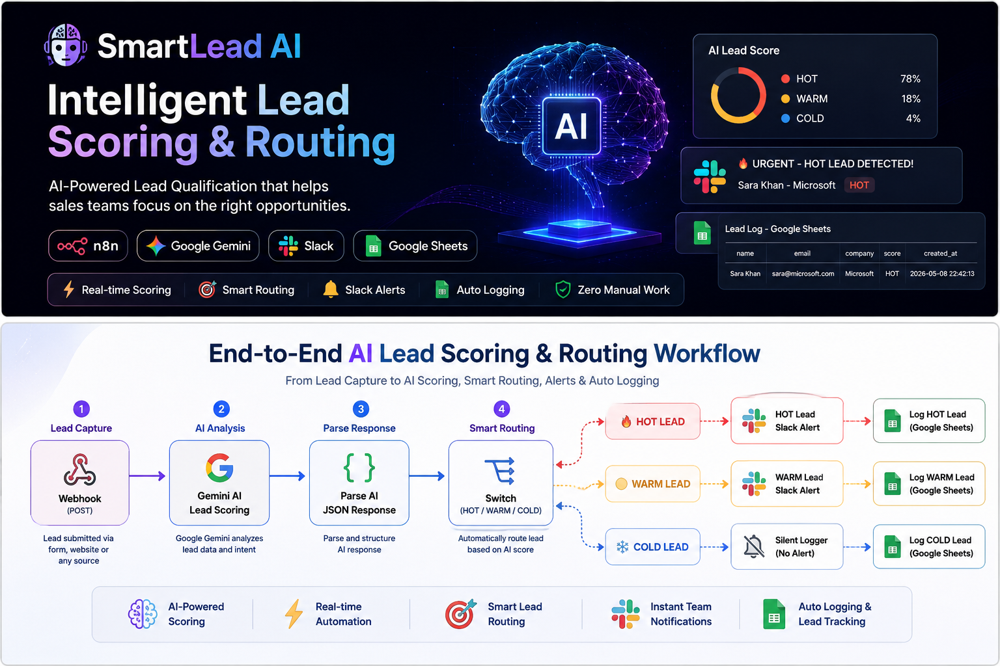
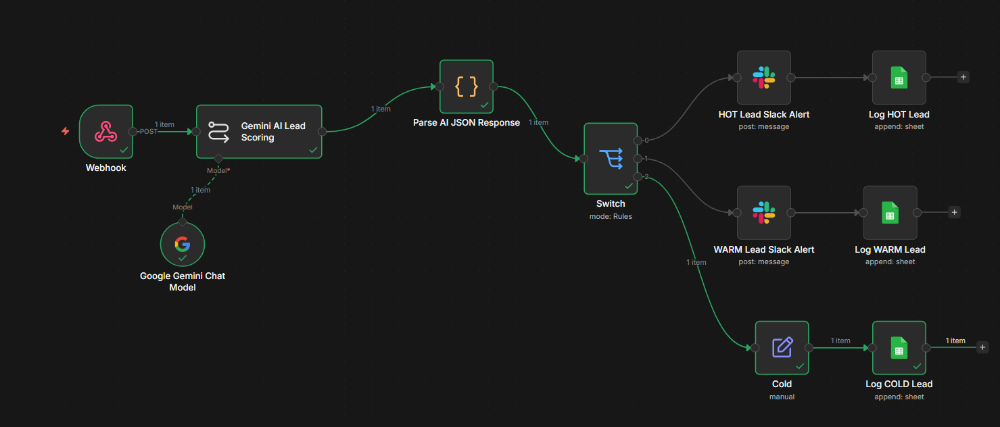
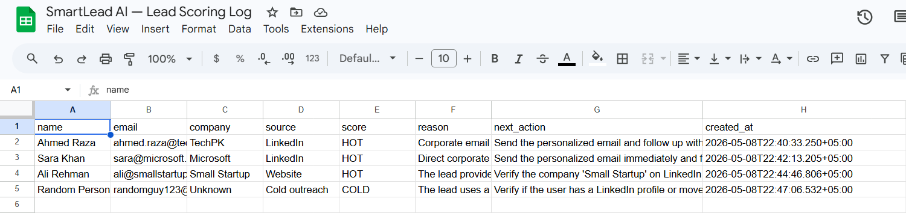
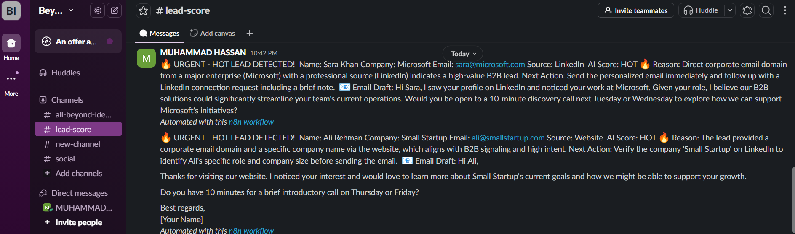
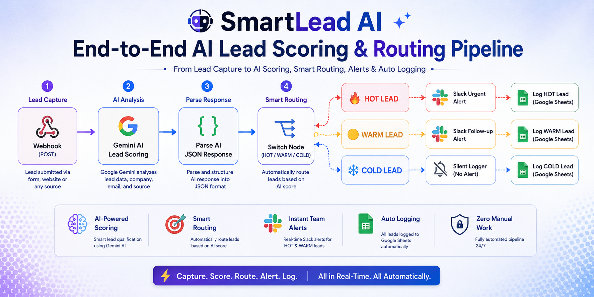

# 🤖 SmartLead AI — Intelligent Lead Scoring & Routing System

AI-powered lead qualification and routing workflow built with n8n and Google Gemini AI.

This automation instantly analyzes incoming leads, scores them using AI, routes them into HOT / WARM / COLD pipelines, alerts sales teams on Slack, and logs all activity into Google Sheets — fully automated in real-time.

---

# 🚀 Features

✅ AI-powered lead scoring using Google Gemini  
✅ HOT / WARM / COLD intelligent routing  
✅ Real-time Slack notifications  
✅ AI-generated personalized outreach emails  
✅ Automated CRM-style logging to Google Sheets  
✅ Webhook-based lead intake API  
✅ Zero manual lead qualification  
✅ Production-ready n8n workflow  

---

# 📸 Project Screenshots

## Workflow Canvas



---

## Google Sheets Lead Database



---

## Slack Lead Alerts



---

# 🎯 What Problem Does This Solve?

Sales teams waste hours manually reviewing leads and deciding who to contact first.

SmartLead AI automates the entire qualification process by:

- ⚡ Instantly scoring every incoming lead
- 🧠 Using AI to analyze company quality and lead intent
- 📣 Alerting sales teams only for high-priority leads
- 📊 Logging every lead automatically
- ✉️ Drafting personalized outreach emails using AI

No spreadsheets.  
No manual filtering.  
No missed opportunities.

---



# 🔄 Workflow Architecture

```text
Webhook (POST)
      ↓
Gemini AI Lead Scoring
      ↓
Parse AI JSON Response
      ↓
Switch Node (HOT / WARM / COLD)
      ↓

├── 🔥 HOT
│      └── Slack Urgent Alert
│              └── Google Sheets Log
│
├── 🟡 WARM
│      └── Slack Follow-up Alert
│              └── Google Sheets Log
│
└── ❄️ COLD
       └── Silent Logger
               └── Google Sheets Log

⚙️ Step-by-Step Workflow
1. Lead Submitted

A lead submits data through a webhook endpoint.

Example:

{
  "name": "Sara Khan",
  "email": "sara@microsoft.com",
  "company": "Microsoft",
  "source": "LinkedIn"
}

2. Gemini AI Analyzes the Lead

Google Gemini AI evaluates:

Email domain
Company quality
Source credibility
B2B intent signals

3. AI Returns Structured JSON

The AI responds with:
{
  "score": "HOT",
  "reason": "Corporate email domain with strong B2B intent",
  "email_draft": "Hi Sara...",
  "next_action": "Send personalized outreach immediately"
}
4. JavaScript Node Parses AI Output

The Code node cleans and parses the AI response into structured JSON.

5. Switch Node Routes Lead Automatically

The workflow intelligently routes leads into:

🔥 HOT
🟡 WARM
❄️ COLD
6. Slack Alerts Trigger

HOT and WARM leads instantly notify the sales team.

7. Google Sheets Logging

All leads are logged automatically with:

AI score
Reasoning
Recommended action
Timestamp
📊 AI Scoring Logic
Score	Criteria	Action
🔥 HOT	Corporate email + LinkedIn/referral source + B2B intent	Instant urgent Slack alert
🟡 WARM	Real company but weaker intent	Follow-up Slack alert
❄️ COLD	Personal email or low-value lead	Silent logging only
💬 Slack Alert Example
HOT Lead Alert
🔥 URGENT - HOT LEAD DETECTED!

Name: Sara Khan
Company: Microsoft
Email: sara@microsoft.com
Source: LinkedIn

AI Score: HOT 🔥

Reason:
Corporate email domain with strong B2B buying intent

Next Action:
Send personalized outreach immediately

Email Draft:
Hi Sara, I noticed your work at Microsoft...
📋 Google Sheets Log Structure
Column	Description
name	Lead full name
email	Lead email
company	Company name
source	Lead source
score	HOT / WARM / COLD
reason	AI reasoning
next_action	Recommended action
created_at	Submission timestamp
🧠 AI System Prompt
You are an expert B2B sales analyst.

Analyze leads and return only raw JSON.

Scoring rules:

- HOT: Corporate email + LinkedIn/referral source
- WARM: Real company but weaker signals
- COLD: Personal email or unclear company

Always return:

{
  "score": "HOT",
  "reason": "Explanation",
  "email_draft": "Email content",
  "next_action": "Recommended action"
}
📡 API Reference
Endpoint
POST /webhook/lead-scoring
Request Body
{
  "name": "Ahmed Raza",
  "email": "ahmed@techpk.com",
  "company": "TechPK",
  "source": "LinkedIn"
}
Example Response
{
  "score": "HOT",
  "reason": "Corporate email with strong B2B signals",
  "email_draft": "Hi Ahmed...",
  "next_action": "Send outreach immediately"
}

🛠️ Tech Stack
Tool	Purpose
n8n	Workflow automation engine
Google Gemini AI	Lead scoring and email drafting
Slack	Real-time sales alerts
Google Sheets	CRM-style lead database
Webhook API	Lead intake
JavaScript	JSON parsing and cleanup
🔧 Setup Instructions
Prerequisites
n8n account
Google account
Google Gemini API access
Slack workspace
Step 1 — Import Workflow
Download smartlead-ai-workflow.json
Open n8n
Click Import
Upload workflow JSON
Step 2 — Add Credentials

Configure:

✅ Google Gemini API
✅ Google Sheets OAuth2
✅ Slack OAuth2
Step 3 — Configure Nodes

Update:

Webhook URL
Google Sheets document
Slack channel
Step 4 — Activate Workflow

Enable the workflow in n8n.

Your AI lead qualification system is now live 24/7.
✅ Test Results

Successfully tested using live lead submissions.

Name	Company	Source	Score
Ahmed Raza	TechPK	LinkedIn	🔥 HOT
Sara Khan	Microsoft	LinkedIn	🔥 HOT
Ali Rehman	Small Startup	Website	🟡 WARM
Random Person	Unknown	Cold Outreach	❄️ COLD
🎯 Use Cases
AI-powered sales qualification
Automated CRM pipelines
Startup lead routing systems
AI sales assistant workflows
Agency automation systems
B2B outreach automation
📂 Repository Structure
smartlead-ai/
│
├── README.md
├── LICENSE
│
├── workflow/
│   └── smartlead-ai-workflow.json
│
├── screenshots/
│   ├── workflow-canvas.png
│   ├── google-sheets-log.png
│   └── slack-alert.png
│
├── assets/
│   ├── workflow-architecture-banner.png
│   └── end-to-end-pipeline-banner.png
🔐 Security Recommendations

For production deployments:

Enable webhook authentication
Add API keys
Restrict Slack channel permissions
Store credentials securely in n8n
📄 License

MIT License — free to use and modify.

👨‍💻 Author

Muhammad Hassan
AI Automation Engineer
n8n • AI Workflows • Sales Automation • Lead Systems
